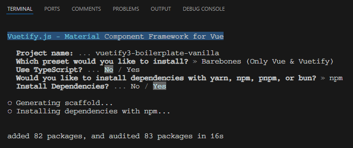
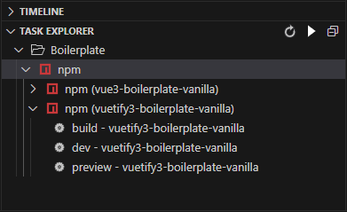

# Vuetify 3 Boilerplate: Vanilla

This is the official scaffolding tool for Vuetify, designed to give you a head start in building your new Vuetify application. It sets up a base template with all the necessary configurations and standard directory structure, enabling you to begin development without the hassle of setting up the project from scratch.

## Install

Set up your project using your preferred package manager. Use the corresponding command to install the dependencies:

| Package Manager                                                | Command        |
|---------------------------------------------------------------|----------------|
| [yarn](https://yarnpkg.com/getting-started)                   | `yarn install` |
| [npm](https://docs.npmjs.com/cli/v7/commands/npm-install)     | `npm install`  |
| [pnpm](https://pnpm.io/installation)                          | `pnpm install` |
| [bun](https://bun.sh/#getting-started)                        | `bun install`  |

After completing the installation, your environment is ready for Vuetify development.

## Usage

This section covers how to start the development server and build your project for production.

### Starting the Development Server

To start the development server with hot-reload, run the following command. The server will be accessible at [http://localhost:3000](http://localhost:3000):

| Package Manager                                                | Command        |
|---------------------------------------------------------------|----------------|
| [yarn](https://yarnpkg.com/getting-started)                   | `yarn dev` |
| [npm](https://docs.npmjs.com/cli/v7/commands/npm-install)     | `npm run dev`  |
| [pnpm](https://pnpm.io/installation)                          | `pnpm run dev` |
| [bun](https://bun.sh/#getting-started)                        | `bun run dev`  |

> Add NODE_OPTIONS='--no-warnings' to suppress the JSON import warnings that happen as part of the Vuetify import mapping. If you are on Node [v21.3.0](https://nodejs.org/en/blog/release/v21.3.0) or higher, you can change this to NODE_OPTIONS='--disable-warning=5401'. If you don't mind the warning, you can remove this from your package.json dev script.

### Building for Production

To build your project for production, use:

| Package Manager                                                | Command        |
|---------------------------------------------------------------|----------------|
| [yarn](https://yarnpkg.com/getting-started)                   | `yarn build` |
| [npm](https://docs.npmjs.com/cli/v7/commands/npm-install)     | `npm run build`  |
| [pnpm](https://pnpm.io/installation)                          | `pnpm run build` |
| [bun](https://bun.sh/#getting-started)                        | `bun run build`  |

Once the build process is completed, your application will be ready for deployment in a production environment.

When using the [Task Explorer](https://marketplace.visualstudio.com/items?itemName=spmeesseman.vscode-taskexplorer) extension in VSCode, the scripts are automatically picked up from the `package.json` file and ready to use.

## Useful Links

- [Vuetify](https://vuetifyjs.com/en/)
- [Components](https://vuetifyjs.com/en/components/all/#containment)
- [Features](https://vuetifyjs.com/en/introduction/why-vuetify/#feature-guides)
- [Theme Configuration](https://vuetifyjs.com/en/features/theme/)
- [Material Colors](https://vuetifyjs.com/en/styles/colors/#material-colors)
